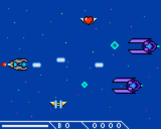

# Firecore - game for *Arduino Esplora*

***

Colored game which looks like old school 8bit games.
Genre: shoot em up

Story describtion:
Invaders come to galaxy from nowhere, one of doges send a message to hero
living at edge of galaxy and ask him to save the galaxy and their home planet.

Game have: 
- simple 8bit color graphics;
- animated sprites;
- 3 different ships;
- moving background;
- level bosses;
- primitive story;
- qute vell performance;
- save maximum score in *EEPROM*;
- *~~explosions~~*;
- *~~sounds~~*;
- *~~a lot of random~~*;

Esplora board feature usage:
- RGB LED used for warn player of ship's low health (it's flash red);
- Light sensor, temperature sensor and microphone used to seed random fuction;
- Buzzer used to ganerate annoying sounds (i.e sfx); 

Controls:
- Fire: *Switch 4 button* (named as *A*);
- Move ship: *Analoge joystick*;
- High Score reset: *Analoge joystick button* + *Switch 2* + *Switch 3* (Wait for *beep*);

Developed only for *Arduino Esplora*!
To upload game to your board need to install *esploraAPI* folder to *Arduino's* libs library!

> Hardware:
> - *Arduino Esplora* board;
> - MCU: *ATmega32u4*;
> - ROM: 28,672 bytes;
> - RAM: 2,560 bytes;
> - TFT LCD: *ST7735* 160x128.

Whole game writed on C (maybe somewhere can be a tiny of C++, but not for a long time...).
At current moment:
- whole game consume 27,386 bytes ROM and 655 RAM;
- all graphics in game consume 8,621 bytes ROM;

[To see how does it work check this link](https://www.youtube.com/channel/UCDXVQ9ZfQl8Ddeu_3qiwSiA "My YouTube channel")
***

  
> ### ATTENTION!
>  * This game is still unstable and in develop!
>  * Any changes are possible at any time!  
